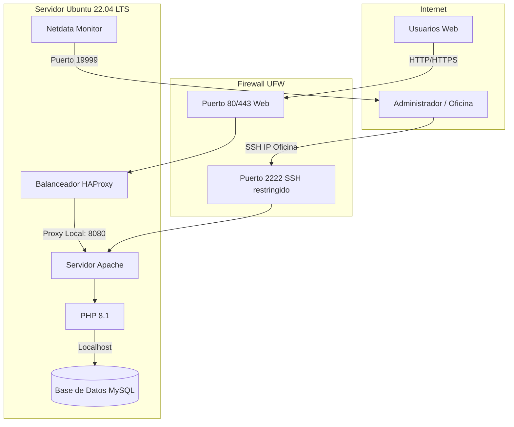

# 02. Diseño de la Infraestructura

Este documento describe el diseño de la red y las versiones de software necesarias para el despliegue del entorno LAMP.

## 🌐 Diagrama de Arquitectura de Red

A continuación se muestra el esquema lógico de las conexiones del servidor dentro de la infraestructura corporativa:

### 🚪 Puertos de Comunicación Utilizados

Para garantizar la seguridad de la plataforma, el cortafuegos UFW gestionará la apertura de los siguientes puertos:

| Puerto | Protocolo | Servicio | Origen Permitido | Descripción |
| :--- | :--- | :--- | :--- | :--- |
| **80** | TCP | HTTP (HAProxy) | Cualquier origen | Tráfico web no cifrado redirigido a HTTPS |
| **443** | TCP | HTTPS (HAProxy)| Cualquier origen | Tráfico web seguro y balanceado |
| **2222** | TCP | SSH | IP de Oficina (`192.168.1.0/24`) | Acceso de administración remota |
| **19999** | TCP | Netdata | Localhost / Túnel SSH | Panel web de monitorización |

---

## 🛠️ Especificación y Versiones de Software

A continuación se detallan los paquetes y las versiones iniciales seleccionadas para este despliegue.

| Componente | Versión Inicial | Descripción / Notas |
| :--- | :--- | :--- |
| **Ubuntu Server** | 22.04 LTS | Sistema operativo base de la infraestructura |
| **HAProxy** | 2.4 | Balanceador de carga y terminación SSL (añadido) |
| **Apache** | 2.4.60 | Servidor web HTTP/HTTPS |
| **MySQL Server** | 8.0 | Gestor de base de datos relacional |
| **PHP** | 8.1 | Intérprete para la aplicación web y de gestión |
| **Netdata** | 1.39 | Herramienta de monitorización en tiempo real |
| **UFW** | 0.36 | Cortafuegos para asegurar puertos del sistema |
| **rsync** | 3.2.7 | Herramienta de replicación para copias de seguridad |
| **Certbot** | 2.9 | SSL/TLS automático |
