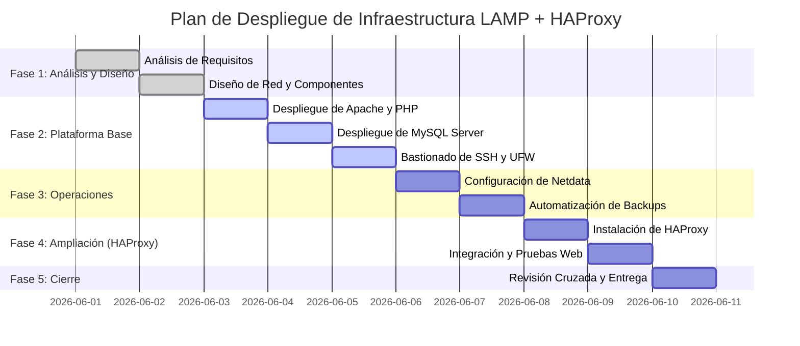

# 03. Planificación del Proyecto

Este documento detalla el cronograma y la asignación de tiempos para el despliegue del entorno y su posterior ampliación con HAProxy.

## 📅 Calendario del Proyecto (Gantt)

A continuación se muestra la secuencia temporal de las actividades planificadas para la implantación de la infraestructura:

---

## 📋 Resumen de Hitos y Tareas

| Fase | Tarea Principal | Duración | Responsable Principal |
| :--- | :--- | :--- | :--- |
| **Fase 1** | Definición de especificaciones y arquitectura lógica | 2 días | Ambos miembros |
| **Fase 2** | Instalación de Apache, PHP, MySQL, seguridad SSH y UFW | 3 días | Documentalista de Plataforma |
| **Fase 3** | Instalación de Netdata y script de backup en cron | 2 días | Documentalista de Operaciones |
| **Fase 4** | Integración del balanceador HAProxy (Cambio de Alcance) | 2 días | Ambos miembros |
| **Fase 5** | Auditoría final de seguridad, enlaces y entrega | 1 día | Ambos miembros |
